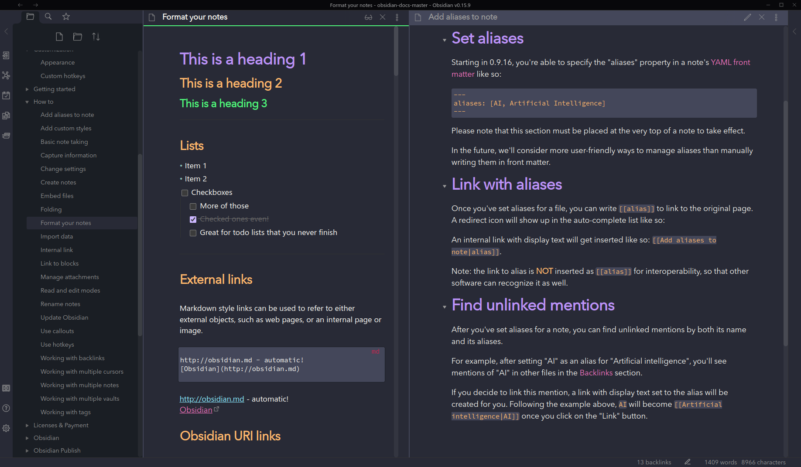

# Dracula for [Obsidian](http://obsidian.md)

> A dark theme for [Obsidian](http://obsidian.md).

## Install

All instructions can be found at [draculatheme.com/obsidian](https://draculatheme.com/obsidian).

## Team

This theme is maintained by the following person(s) and a bunch of [awesome contributors](https://github.com/dracula/obsidian/graphs/contributors).

 |
--- |
[Andy Byers](https://github.com/andybyers21) |

## Contributing

If you'd like to contribute to this theme, please read the [contributing guidelines](./.github/CONTRIBUTING.md).

## License

[MIT License](./LICENSE)
